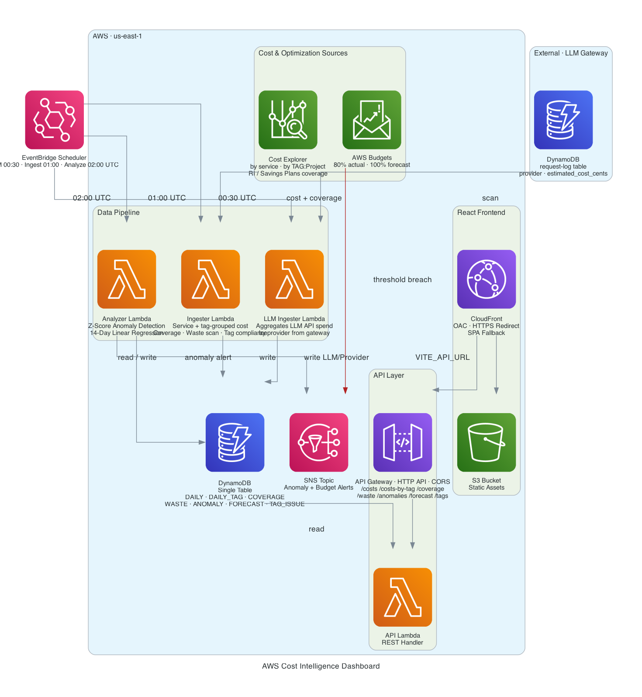

# Case Study: AWS Cost Intelligence Dashboard

## Problem

Cloud cost tools answer "what did we spend by service." They rarely answer the
question a FinOps practice actually needs: **who owns this spend, where is it
being wasted, and what will it be next month.** Tag-based cost allocation is the
mechanism for the first question, but it fails silently in ways that are easy to
miss, a tag applied with the wrong casing, a tag that was never activated in
Cost Explorer, or resources that escape tagging entirely.

This project is a self-hosted cost visibility platform on AWS that ingests Cost
Explorer and LLM API spend, and layers on the FinOps controls that make cost
data actionable: allocation by owner, waste detection, reservation coverage,
budgets, and anomaly detection.

## Architecture

Event-driven and serverless. EventBridge Scheduler triggers three Lambdas on a
daily cadence (LLM ingest → cost ingest → analyze). Data lands in a single
DynamoDB table partitioned by record type (`DAILY`, `DAILY_TAG`, `COVERAGE`,
`WASTE`, `ANOMALY`, `FORECAST`, `TAG_ISSUE`). An HTTP API Gateway fronts a read
Lambda; a React SPA is served from S3 through CloudFront with Origin Access
Control. Four separate Lambda execution roles enforce least privilege per layer.

## What was built

- **Cost allocation by owner.** A second Cost Explorer query groups the 90-day
  window by the `Project` cost allocation tag, stored as `DAILY_TAG` records.
  Spend with no project tag is surfaced explicitly as `No Project`, so
  unallocated cost is visible rather than hidden.
- **Waste scan.** The ingester describes EBS volumes and Elastic IPs and flags
  unattached volumes, unassociated EIPs, and legacy gp2 volumes (gp3 is ~20%
  cheaper for the same performance), each with an estimated monthly dollar cost.
- **Reservation / Savings Plans coverage.** Daily RI and SP coverage percentages,
  so low coverage on steady-state spend is a visible signal.
- **Budgets + native anomaly detection.** An AWS Budgets budget (80% actual /
  100% forecast) and an optional AWS-managed anomaly monitor run alongside the
  custom z-score analyzer, so detection does not depend on a single detector.
- **Tag governance.** Provider-level `default_tags` guarantees every resource is
  created with the canonical tag set; a compliance scanner flags anything missing
  a required tag.

## Engineering decisions worth calling out

**A tagging bug that flagged 100% of resources as non-compliant.** The original
design applied tags in lowercase (`project`, `environment`) but the compliance
scanner checked for TitleCase (`Project`, `Environment`) with an exact string
match. Every resource reported as non-compliant even though everything was
tagged. The fix was to make TitleCase the single canonical casing, move it into
provider `default_tags` so nothing is created untagged, and align the required
list to match. The lesson: a tag governance check is only as good as its
agreement with what actually gets applied.

**Two AWS account constraints, turned into opt-in toggles.** Deploying surfaced
two real limits: `aws_ce_cost_allocation_tag` can only activate a tag key Cost
Explorer has already seen in billing data (a fresh deploy fails with `Tag keys
not found`), and AWS permits only one dimensional `SERVICE` anomaly monitor per
account. Rather than let either break `terraform apply`, both are gated behind
`enable_*` variables that default off, documented with the reason. The tags are
still applied and `/costs-by-tag` still works, it just shows spend under
`No Project` until activation propagates (up to 24h).

## Validation

Deployed to AWS (43 resources), the ingester was invoked manually, and the new
endpoints were verified live: `/coverage` returned real RI/SP data, `/costs-by-tag`
correctly surfaced untagged spend, `/waste` ran and found nothing to flag on a
clean account. The stack was then destroyed to keep spend near zero, the FinOps
way.

## Result

A cost platform that answers the questions a FinOps review actually asks, built
on serverless primitives that cost cents to run and tear down cleanly. The
interesting work was less the pipeline and more the correctness of cost
allocation: tag casing, activation, and untagged-spend visibility are exactly
where real cost-allocation programs quietly fail.
